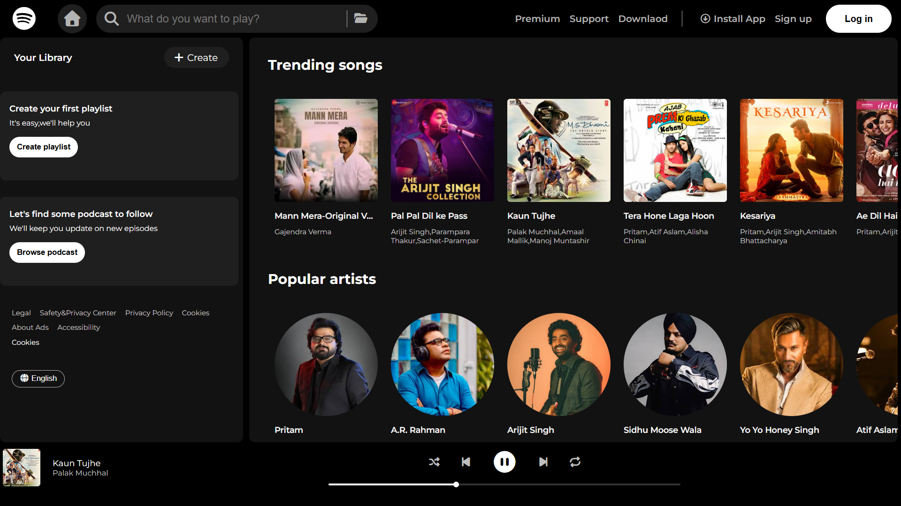
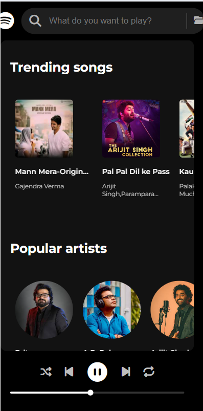

# Spotify Clone

A responsive Spotify Clone built using HTML, CSS, and JavaScript. This project recreates the look and feel of Spotify Web Player and includes music playback controls, shuffle, repeat, progress tracking, and a modern user interface.

## Features

- Play and Pause songs
- Previous and Next controls
- Shuffle mode
- Repeat mode
- Dynamic progress bar
- Display currently playing song information
- Trending Songs section
- Popular Artists section
- Responsive design for desktop and mobile devices
- Modern dark theme inspired by Spotify

## Technologies Used

- HTML5
- CSS3
- JavaScript

## Screenshots

### Desktop View



### Mobile View



## Folder Structure

```text
Spotify Clone
│
├── Audio
├── Images
├── index.html
├── style.css
├── script.js
└── README.md
```

## How to Run

1. Download or clone this repository.
2. Open `index.html` in your browser.
3. Enjoy listening to music.

## Future Improvements

- Volume control
- Search functionality
- Playlist support
- Favorite songs
- Dynamic song loading

## Author

Mohammed Naeem Patel

---

This project was created for learning and practicing JavaScript concepts such as DOM manipulation, event handling, audio controls, and responsive web design.
